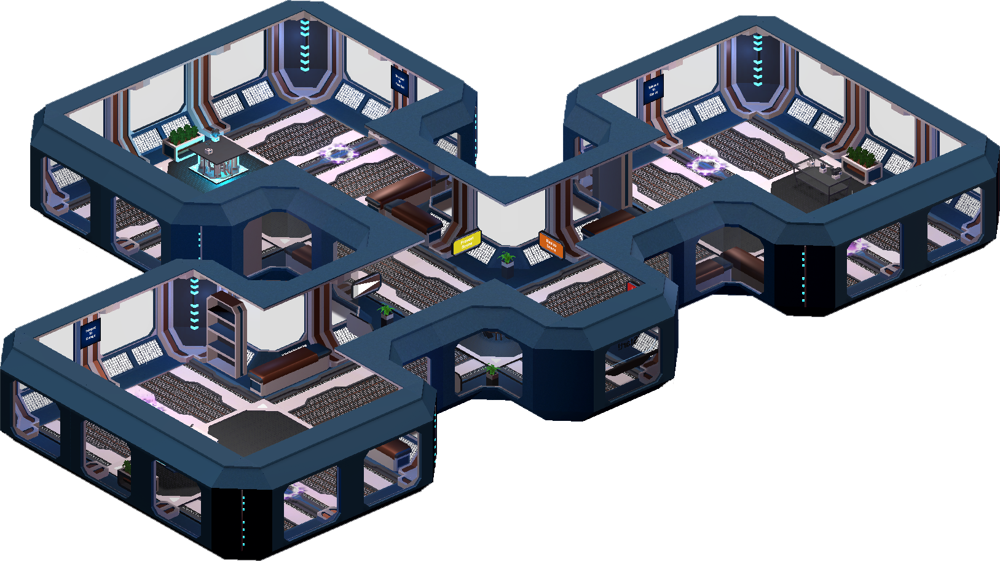

## intUItive!
Intuitive (stylised as **intUItive!**) is a project to showcase Virtual Reality (VR) user interface
and user interaction (UI/UX) principles in the VR environment itself.

## Objectives
Our project hopes to better internalise design principles through embodied teaching and experience.
Because VR is a very new platform, the design paradigms are not all set in stone,
so we wish to allow the user to play around various VR interactions and interfaces in our project to
experience for themselves what suits their needs.

## Map
Below is a guide to the various parts of our project.
Our project is split into 6 scenes. Click to check out each individual scene!

Labels to be added soon.

[1. UI Distance](6_Relocation/relocation.md)\
[2. Grabbing](3_Grabbing/grabbing.md)\
[3. HUD](HUD/hud.md)\
[4. UI Height (Todo)](#)\
[5. UI Resize (Todo)](#)\
[6. Hick's Law](4_HicksLaw/hickslaw.md)

## Screenshots and Demo

TODO: Video and Demo here. Stay tuned!

## Team Information
**Choong Zhan Hong** ([linkedin](https://www.linkedin.com/in/choongzhanhong/)/[website](https://choongzhanhong.github.io/))

**Christabelle Fredda Thevandi**

**Lim Rui Xiong**

**Ng Yu Zhong** ([linkedin](https://www.linkedin.com/in/ng-yu-zhong-3ba599142/))

**Park So Hyun**

**Soh Xin Wei** ([linkedin](https://www.linkedin.com/in/xiinweii/))